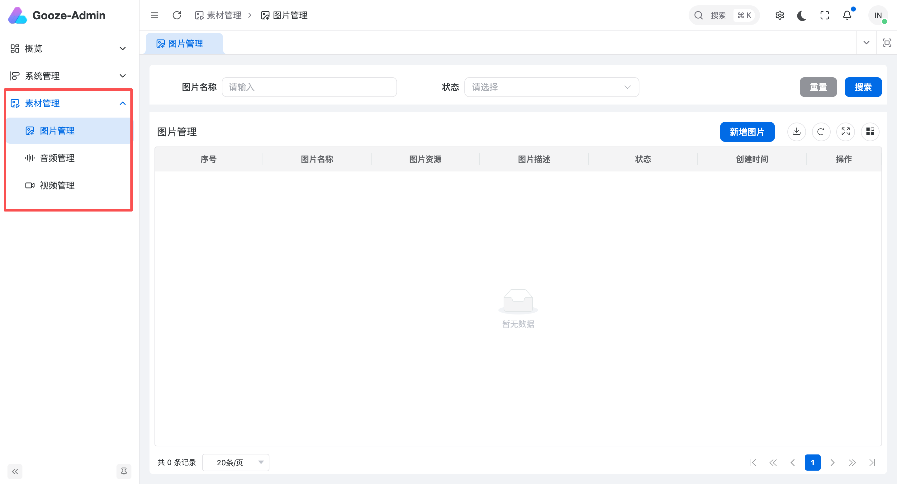

<h1 align="center">Gooze-Vben-Admin</h1>

<p align="center"> 基于 vue-vben-admin (Element-plus) +后端 Go(Gin、gorm) 实现的管理后台</p>

<p align="center">实现了用户、菜单、角色、API 权限管理；后端接口可快速移植至老项目中</p>

<br>

## 快速开始

1. 下载

```bash
git clone https://github.com/soryetong/gooze-vben.git
```

2. 启动 admin

> 要求：`node` 版本 20 以上，`pnpm` 9.15 以上

> 我的 `nvm use 20.11`，`pnpm` 9.15.5

```bash
cd gooze-vben/gooze-vben-admin

# 使用项目指定的pnpm版本进行依赖安装
npm i -g corepack

# 安装依赖
pnpm install

# 启动
pnpm dev
```

3. 启动服务器

> 要求：go 1.24

```bash
cd gooze-vben/gooze-vben-api

# 导入 docs/sql/default.sql

# 修改 `configs/config.yaml` 文件，将数据库链接地址修改为你的数据库链接地址。

# ⚠️⚠️⚠️：一定要修改数据库链接地址

sh ./build/scripts/start_server.sh
```

4. 访问第 2 步输出的地址即可

<br>

## 最新更新

1. 新增了富文本编辑器，使用的是 `@wawangeditor`，用法如下：

```vue
{
  component: 'RichEditor',
  fieldName: 'introDetail',
  componentProps: {
    height: '400px',                 // 编辑器高度，默认 400px
    placeholder: '请输入内容...',     // 占位文字，默认 '请输入内容...'
    disabled: false,                // 是否禁用，默认 false
  },
}
```

2. 新增素材管理(见最后一张图)，支持图片、视频、音频、文件（即将更新），用法如下：

```vue
{
  component: 'MaterialPicker',
  fieldName: 'imgUrl',
  componentProps: {
    type: 'image',              // 素材类型：'image' | 'audio' | 'video'
    multiple: false,            // 是否多选，默认 false
  },
}
```

3. 新增了 `MaterialUpload` 组件，它和 `MaterialPicker` 的区别在于，`MaterialUpload` 是上传组件，`MaterialPicker` 是选择组件，`MaterialUpload` 可以对单个素材进行控制

```vue
{
  component: 'ImageUpload',
  fieldName: 'image',
  componentProps: {
    limit: 1,           // 最大数量
    maxSize: 500,       // 最大大小
    sizeUnit: 'KB',     // 'KB' | 'MB'
    accept: 'image/jpeg,image/png',
    autoReplace: false,
  },
}
```

4. 修复了 「修改角色的权限后, 再次修改时, 还是显示 所有权限都勾选了」的 bug， @[issues12](https://github.com/soryetong/gooze-vben/issues/12)

<br>

## 介绍

> 后端介绍 [看这里](./gooze-vben-api/README.md)
>
> 前端直接使用的 `vue-vben-admin` [看这里](https://doc.vben.pro/)

<br>

## 演示地址

> 复制地址访问：http://8.137.16.100:5003/
>
> 默认账号密码: `admin` / `admin`
>
> 注意 📢：该账号下的数据都不可操作，你可以新建账号操作

<br>

## 技术栈

-   后端基于 Golang + Gin + Gorm

> 权限基于 `Casbin` 实现

-   前端基于 Vue3 + TypeScript + Element-plus + Vben Admin

<br>

## 功能列表

> 详细功能可访问演示站进行使用

-   用户登录


-   菜单管理


-   角色管理


-   接口管理


-   字典管理


-   操作日志


-   素材管理

